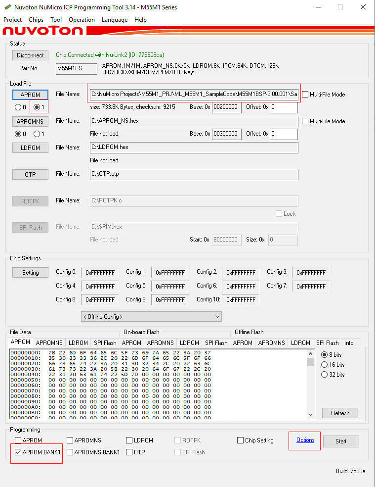
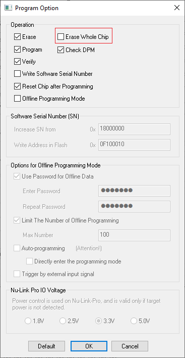

# NN_ModelEasyDeploy
This sample demonstrate how to easily deploy new image classification model[^1] and label to target. 
## Requirement
1. Keil uVision5
2. Nuvoton ICP tool
## Howto
1. Using Tool/Model_Labels_packer.py to pack new model and label into a model binary file
```
python Model_Labels_Packer.py -m model_vela.tflite -l label.txt
```
2. Burn model binary file into flash bank1 by ICP tool


[^1]: Model must be compilied by vela

