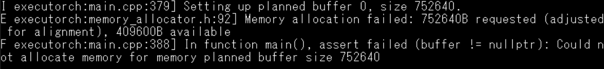
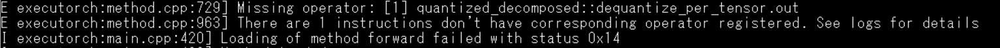

# NN_ExecuTorch
A template sample code for executorch Arm backend
## Requirement
1. [executorch](https://github.com/pytorch/executorch) v0.7
2. Keil uVision5
## Howto
1. Compile your pytorch model by executorch. It will generate a .pte model file.[^1]
2. Copy .pte file to SD card and rename to model.pte
3. Insert SD card to NUMAKER-M55M1 board
4. Run
## Troubleshooting
1. If got "Memory allocation filed" message, enlarge method_allocation_pool space.

 
```
__attribute__((section(".bss.sram.data"), aligned(32)))
uint8_t method_allocation_pool[1400 * 1024U];
```
2. If got "Missing operator" message, search operator code from "$BSP\ThirdParty\executorch\_prebuilt\kernels\portable\RegisterCodegenUnboxedKernelsEverything.cpp" or "$BSP\ThirdParty\executorch\_prebuilt\kernels\quantized\RegisterCodegenUnboxedKernelsEverything.cpp" and copy kernel operator code to "RegisterNativeKernels.cpp".



```
    Kernel(
        "quantized_decomposed::dequantize_per_tensor.out",
        [](torch::executor::KernelRuntimeContext & context, EValue** stack) {
            EValue& input = *stack[0];
			EValue& scale = *stack[1];
			EValue& zero_point = *stack[2];
			EValue& quant_min = *stack[3];
			EValue& quant_max = *stack[4];
			EValue& dtype = *stack[5];
			EValue& out_dtype = *stack[6];
			EValue& out = *stack[7];
			const torch::executor::Tensor & input_base = input.to<torch::executor::Tensor>();
			double scale_base = scale.to<double>();
			int64_t zero_point_base = zero_point.to<int64_t>();
			int64_t quant_min_base = quant_min.to<int64_t>();
			int64_t quant_max_base = quant_max.to<int64_t>();
			torch::executor::ScalarType dtype_base = dtype.to<torch::executor::ScalarType>();
			
			auto out_dtype_opt_out = out_dtype.toOptional<torch::executor::ScalarType>();
						
			torch::executor::Tensor & out_base = out.to<torch::executor::Tensor>();
        
            internal::EventTracerProfileOpScope event_tracer_op_scope(context.internal_event_tracer(), "native_call_dequantize_per_tensor.out");
            EXECUTORCH_SCOPE_PROF("native_call_dequantize_per_tensor.out");
            torch::executor::native::dequantize_per_tensor_out(context, input_base, scale_base, zero_point_base, quant_min_base, quant_max_base, dtype_base, out_dtype_opt_out, out_base);
            internal::event_tracer_log_evalue(context.internal_event_tracer(), *stack[7]);    

        }
    ),
```
[^1]:[Building and Running ExecuTorch with ARM Backend](https://pytorch.org/executorch/stable/executorch-arm-delegate-tutorial.html)
