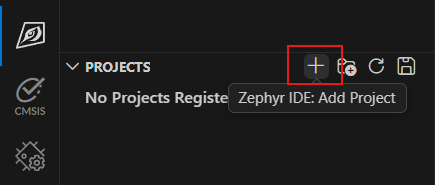
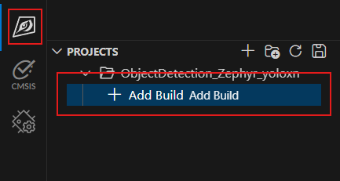

# YOLOX-Nano Object Detection Sample #

This is an YOLOX-Nano neural network inference sample for object detection running on the Nuvoton M55M1 microcontroller with the Zephyr RTOS. Here's what it does:

Key Features:
1. Real-time Object Detection: Uses the YOLOX-nano model (a lightweight variant of YOLO) to detect objects in images captured from an image sensor (HM1055)
2. Hardware Acceleration:
    - Leverages the Ethos-U NPU (Neural Processing Unit) for accelerated AI inference
    - Uses HyperRAM for model storage (external high-capacity memory)
    - Supports I/D caching for improved performance
    - Custom SRAM2 configuration for optimal memory layout
3. Image Capture & Processing:
    - Captures images from an HM1055 image sensor via CCAP (Camera Capture)
    - Resizes images to the model's input dimensions (RGB565 → RGB888)
    - Quantizes data for efficient model inference
    - Draws bounding boxes on detected objects
4. Multi-threaded Architecture:
    - Main task: Handles image capture and display
    - Inference task: Processes AI inference independently
    - Uses Zephyr message queues for thread synchronization
5. Optional Features:
    - UVC (USB Video Class): Stream results over USB
    - SD Card Support: Load the model from SD card instead of embedding it
    - Profiling: Performance monitoring and cycle counting
6. Supported Configurations (Kconfig):
    - Enable/disable application profiling
    - Toggle UVC image streaming
    - Load model from SD card or use embedded model

Software Stack:
- TensorFlow Lite Micro with CMSIS-NN optimization
- Arm ML Embedded Evaluation Kit for common ML utilities
- OpenMV (OMV) library for image processing
- Zephyr OS for real-time task scheduling
- FatFS for SD card file system

## Model Informaion ##
YOLOX (You Only Look Once – X) is a high-performance, anchor-free object detection framework.
It improves upon earlier YOLO versions (YOLOv3–YOLOv5) by introducing:
- Anchor-free design → simplifies training and improves generalization.
- Decoupled head architecture → separates classification and localization tasks for better accuracy.
- Advanced training strategies like label assignment and strong augmentation.

YOLOX-Nano is a ultra-lighweight YOLOX model optimized for low-power devices(MCUs, mobile CPUs, NPU). It offers lower accuracy compared to larger YOLOX models(YOLOX-S, YOLOX-M, YOLO-L), but much faster and lighter.

|Information||
|:----|:----|
|Framework|PyTorch|
|Paper|https://arxiv.org/abs/2107.08430|
|Provenance|https://github.com/Megvii-BaseDetection/YOLOX|
|Parameters| ~0.9M|
|COCO mAP(0.5:0.95)| 0.200|
|Model ROM size|1289KB|
|Model RAM(arean) size|802KB|

[NuEdgeWise](https://github.com/OpenNuvoton/ML_YOLO) provides YOLOX Nano-related transfer learning scripts and model conversion tools(from PyTorch to tflite). You can customize your own classes in this environment and deploy to M55M1.

## RAM usage ##
This sample demonstrates the usage of the M55M1 RAM in the following regions:

| Region | Address | Size | M55M1 RAM | Data Type|
|:----|:----|:----|:----|:----|
|RAM|0x20100000|128KB|Part of SRAM0|Kernel read-write data|
|DTCM|0x20000000|128KB|DTCM|System heap and statck|
|SRAM2|0x20200000|320KB|SRAM2|Non-cachable, CCAP image frame buffer|
|SRAM_HYPERRAM|0x81F20000|4000KB|Part of SRAM0, SRAM1 and HyperRAM|Model arena cache|

## Setup and Build ##
This sample is based on Zephyr RTOS. Please follow the steps below to install and setup the compilation environment.
1. Follow [Zephyr IDE with NuMicro Cotrext-M on VSCode](../../Doc/Zephyr/Zephyr%20IDE%20with%20NuMicro%20Cotrext-M%20on%20VSCode.md) guiding to install Zephyr host tool, SDK and workspace.
2. Install tflite-micro external module
```
west config manifest.project-filter -- +tflite-micro
west update
```


3. Add sample project




4. Add project build




5. ffadaf


## Configuration

## Performance

